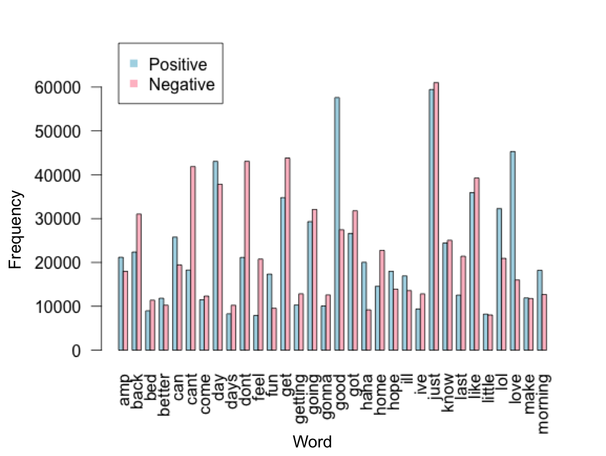
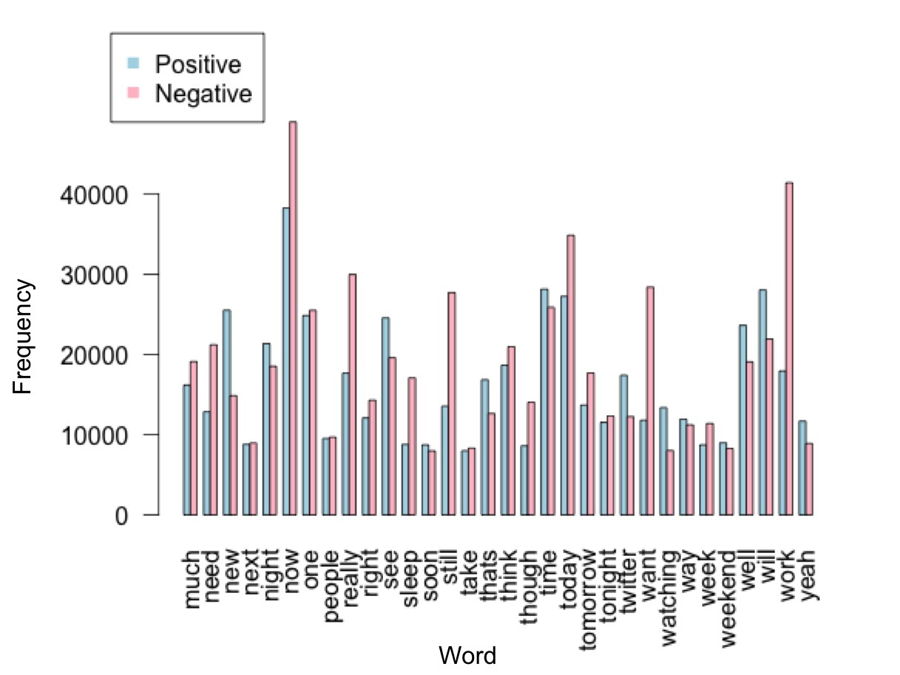
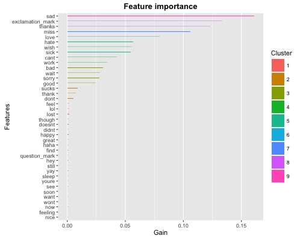
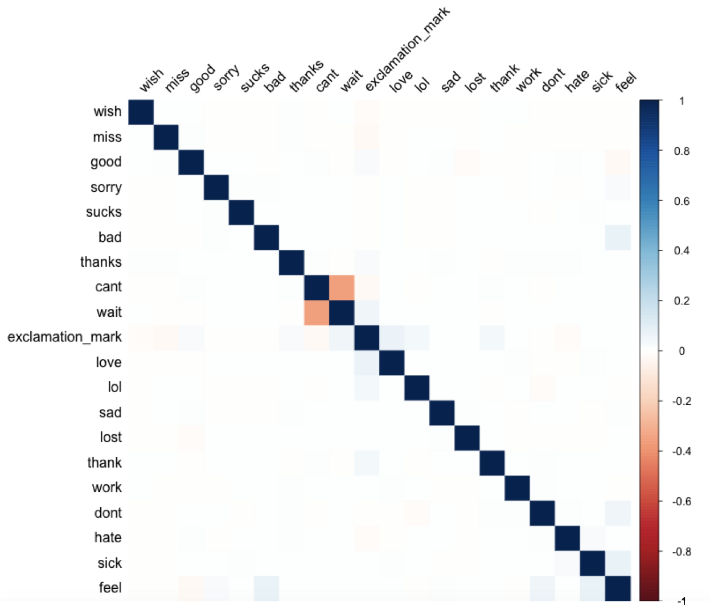
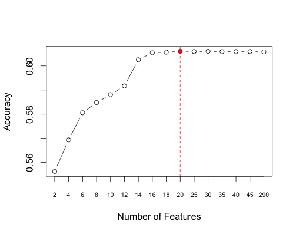

```{r include=FALSE}
#suppressMessages(library(printr))
```

```{r include=FALSE}
load("../data-mod-log/userhashpop.RData")
load("../data/raw.RData")
load("showCV_table.RData")
```

<hr>
## EXAMPLE CODE!

##3.2 $\triangle$TF-IDF

$\hat{y}$ is our estimate.

The $\triangle TF-IDF$ value for a term t in the ith Tweet is $\triangle TF-IDF_{t,i} = TF_{t,i} \times log_{2} \left( \frac{P}{P_{t}} \frac{N_{t}}{N} \right)$, where $TF_{t,i}$ is the number of times t appears in the ith Tweet, $P$ the total number of positive Tweets, $P_{t}$ the number of positive Tweets that have t in them, $N$ the total number of negative Tweets, and $N_{t}$ the number of negative Tweets that have t in them.

<hr>

### Include this in paper:

After finding the max AUC values for the 2 sets of static parameter values and the single set of parameters - from the 5-Folds CV over 300 randomly generated XGBoost model parameters - I decided to attempt a customized approach to the CV and optimization of the boosting model. When I put my parameters from one of static sets into the training algorithm I found that the best mean error for classification was *0.2506* at an iteration index of *127*. Somewhat similarly, I found that when using a custom normalized Gini optimization function, the best score was *0.7059* at the optimal index of *131*.

Due to fluctuations between models with slight parameter tweaks and the low performance of nearly all models on classifiying negative tweets, we decided to incorporate Ensemble Learning by combining sets of our models. We can perform the combination of predictions per model by using either an averaging approach, with mean averaging and geometric averaging options, or a majority rule approach.

**EXPLAIN WHAT WE FOUND WHEN WE DID THIS AND HOW WE COULD GO ABOUT THIS IN BETTER WAYS IN THE FUTURE WITH MORE TIME**

Although the ensemble approach is very enticing, there may be doubt cast on the validity of blindly picking and combining predictors if proper statistical comparisons are not made. For example, in our next steps we would want to compare the correlation between models using the Pearson's Coefficient algorithm. Then we would want to combine models that are the most uncorrelated to combine. This helps prevent overfitting as well as accounts a complex emergence of combined model behavior due to drastically different model structures. An interesting approach we could try is the use of recursive decision trees applied on the outcome of SVM in various ways.

<hr>

# 1 Introduction

### 1.1 Why Twitter Sentiment?

  Social media has rapidly become a substantial way of communication due to a constant influx of new users, modes of language expression (*e.g. emoticons*), and units of socio-cultural importance. From both a sociological and information theory standpoint, social media platforms such as Twitter provide an unprecendented depth of knowledge and insight into language and communication in a human-technology infused ecosystem. With an average of 6,000 tweets sent per second and 500 million per day [1], the use of Twitter for self-expression, group-based decision making, and socio-cultural communication is an essential component of modern society. The ability to analyze and predict trends in tweet sentiment may prove useful through: a) financial benefits for industry, b) exploring human behavior within socio-economic, culutural, and linguistic research, and c) discovering novel modes of language in a world where human life and technological advancement are intimidately related.

### 1.2 Our Data

  We were provided a set of nearly *1.6 million tweets*, as character strings, and corresponding sentiment scores (*0 or 1*) of all but the first 50,000 observations. This first subsample of unscored data is put aside as the final data to test model predictions. No metadata were provided. For example, we did not have the user IDs of the tweets. Our data consist of only the tweet, source, and sentiment.

### 1.3 Let's Explore this Data!

##### 1.3.1 First Look

  Initially we found that nearly all tweets came from source <code>Sentiment140</code>, with a small subsample of the tweets from <code>Kaggle</code>, a Twitter sentiment challenge on Kaggle based on movie sentiment [2]. Another attribute of the data that we found (and corrected) was the existence of unmatched double quotation marks within a set of tweets. Using the <code>Regex</code> package in *R* we replaced such quotation marks.

##### 1.3.2 Data Breakdown

  The raw data contains `4` variables: `ItemID`, `Sentiment`, `SentimentSource`, and `SentimentText`. There are `r nrow(raw.data)` total tweets. There are `r sum(raw.data$Sentiment == 1)` positive tweets, `r sum(raw.data$Sentiment == 0)` negative tweets, and `r sum(raw.data$Sentiment == -1)` unlabeled tweets.

##### 1.3.3 Positive and Negative Word Distributions
  We first examined 


  As shown in figure 1 (below), there were differences between the word occurrences of positive and negative tweets.

  

  <br>

  


# 2 Feature Engineering

### 2.1 Username/Hashtag Positive/Negative Score Features

  After we loaded the raw data into `R` and explored the tweets, we began the feature engineering process. We focused on using the strings of tweets to extract useful information and construct features. We did not use the `ItemID` and `SentimentSource` variables in the raw data. The first set of features we constructed were based on the frequency of usernames and hashtags in the tweets. We wanted to explore the possibility that certain usernames/hashtags tend to appear in more positive or more negative tweets. To build those features, we first divided the data set into a set of positive tweets and negative tweets. For each set, we calculated the frequencies of each unique username and hashtag. For example, `@mileycyrus` appeared `2833` times in the positive tweets. With this information, we gave each username and hashtag a positive and negative score. The scores were calculated by dividing each username's/hashtag's frequency by the postive/negative set's highest username/hashtag frequency. Finally, if a particular username/hashtag appeared in a tweet, we assigned the tweet a corresponding username/hashtag score. Ultimately, this process created `4` features: positive username score, positive hashtag score, negative username score, and negative hashtag score.

The top 5 usernames found in the positive tweets:
```{r, echo=FALSE}
head(pos.usernames.subset, 5)
```

The top 5 usernames found in the negative tweets:
```{r, echo=FALSE}
head(neg.usernames.subset, 5)
```

### 2.2 Bag of Words with $\triangle$Term Frequency-Inverse Document Frequency ($\triangle$TF-IDF)
  In addtion, we used the **Bag of Words (BOW)** approach to construct a term corpus for both positive and negative tweets (with words that appear in at least 1% of the tweets, i.e. **118** words) [3]. We also incorporated key words and characters that could potentially be related to sentiment (e.g. exclamation mark and *LOL*). Furthermore, we included the 50 most frequent usernames and 50 most frequent hashtags. In all, we had 290 "terms" in our corpus. 
  For each term t, we computed its $\triangle$TF-IDF value as $\triangle TF-IDF_{t,i} = TF_{t,i} \times log_{2} \left( \frac{P}{P_{t}} \frac{N_{t}}{N} \right)$, where $TF_{t,i}$ is the number of times t appears in the ith Tweet, $P$ the total number of positive Tweets, $P_{t}$ the number of positive Tweets that have t in them, $N$ the total number of negative Tweets, and $N_{t}$ the number of negative Tweets that have t in them [4]. Therefore, in addition to the 4 score features mentioned above, we have 290 $\triangle$TF-IDF values as our features.


# 3 Cross Validation (CV) and Model Formation

### 3.1 Feature Selection Overview
  Since the username and hashtag scores are metrics that have not been characterized, we first sought to perform feature selection on the 290 $\triangle$TF-IDFs using Random Forest to determined feature importanct (Fig. 2a). 
  
  
  
  We then assessed different subsets of the 290 features using Random Forest and determined that using the 20 most important $\triangle$TF-IDF features perform the best (Fig. 2b). We checked that these 20 fetures are not correlated to each other (Fig. 2c). 
  
  INCLUDE THE PLOT (Fig. 2b)
  
  


  

  Through various feature importance and selection methods, we found that a majority of the loss reduction within random forest and boosting methods (via XGBoost) was captured by a small subset of our total features. For example, we approached the problem initial with <strong>50</strong> features from the respective word frequencies via Bag-of-Words and four normalized features corresponding to usernames and hashtags that occurred most frequently with both positive and negative tweets. Feature selection in both random forest and gradient boosting (XGBoost) dramatically selected for the four normalized username and hashtag predictors. Furthermore, the same pattern existed when increasing our Bag-of-Words term frequency usage from 50 to 118 words. We had also found that our initial models - including logistic regression with regularization, random forest, and gradient boosting tree ensemble (XGBoost) - generally obtained significantly greater accuracy and decreased misclassification for positive than negative tweets. For example, one method produced an accuracy above 80% for positive and just over 50% for negative tweets. As expected, when we compare the negative prediction accuracy and misclassification rate to random guessing we see minimal to no benefit.

  One possible explanation for the discrepancy in sentiment prediction may be due to feature engineering bias. The total number of positive and negative tweets was nearly equal in the original dataset. However, our <strong>Bag-of-Words</strong> and <strong>Term Frequency - Inverse Document Frequency</strong> methods may not have captured the vast array of word choices for negative tweets as we simply took words that occurred in at least 1% of all tweet words. This rests on the assumption that single word use and frequency either 1) give a general, accurate account for tweet sentiment differences and 2) the underlining distributions of positive and negative word counts and frequencies are equal. The first point could be explained by claiming that some <strong>n-gains</strong> or set of words would give stronger features. The second point comes from the statistical conceptualization of finding signal within noise of data. To elaborate, in order to use the word frequencies and differences between positive and negative tweets from the words that appeared in at least 1% of tweet words, we must assume that such words are a valid subsample. Thus, we are assuming that the 118 words that occurred in at least 1% of the total tweet words are an accurate representation of both the actual word frequencies (for all words) in all tweets and the differences in usage between positive and negative sentiment.

  On the other hand, we used normalized username and hashtag occurrence scores for positive and negative features. These four features were far less sparse than the Bag-of-Words and TF-IDF generated features - i.e. far less observations with <strong>0</strong>. This can bias the importance of those features in the decrease in misclassification (loss, similar principle can apply for other forms of optimization) for each node split.

### 3.2 Incorporating Normalized Scoring

  Surprisingly, we obtained significant increases in the quality of our accuracy, AUC, and (decreased) train and test mean error through the incorporation of <strong>4 normalized username and hashtag features</strong>. These 4 extra predictors were obtained by calculating the relative frequency of positive and negative usernames and hashtags for all unique instances of each.

<strong>I think the beginning of this section (3) needs to be cut and put here after explaining the delta-TF-IDF. Also, the first and second paragraphs of this section (3) have stuff about future direction that we need to put in that section (at the end).</strong>

# 4 Model Formations and Results

All models were analyzed using **5-Fold CV** to optimize mean error and / or AUC:

```{r, echo = FALSE}
head(models.df)
```

### 4.1 Random Forest

  We used random forest approaches to perform initial model runs, as well as feature importance, with our 290 generated delta TF-IDF predictors. Feature importance analysis with random forest and XGBoost approaches involved examining the *gain* of each feature as an average of net total over all node splits. Gain is measured as the decrease in misclassifications - or recipricol of increase in correct classification.

### 4.2 Compare XGBoost

  We used XGBoost with optimal parameter tuning on 300
randomly generated values within specified bounds (parameter-specific).
Through these randomly generated parameter sets, we ran 5-fold Cross-Validation
with a 20% subsample of the total labeled data. Out of this 20% subsample
we used a 90% / 10% split for training and testing in-group, respectively.
Our 300 random parameter searches, via grid search methods from the <code>Caret</code>
package in <code>R</code>, were performed in sets of 50 so we could ultimately
rank and analyze 6 different sets of optimal parameters. The best set, in terms of
maximum AUC values, was used to generate our most accurate model by total accuracy.

The results and comparison of several models are summarized in the table below:

```{r, echo = FALSE}
head(CV.df)
```

### 4.3 Linear and Gaussian K-SVM

<strong>Not sure if we are including this section really? Or I guess at the least we can say we ran them etc.</strong>

# 5 Model Analysis and Fine Tuning

### 5.1 Feature Selection and Tuning

We performed several optimization and parameter tuning tricks, including:

1. various train / test splits of the labeled (sentiment of 0 or 1) data from 50% / 50% to 90% / 10%

2. early stopping (XGBoost) when loss is not improved for <code>10-50</code> iterations of boosting - this is an optimal method to extracting optimal iteration number while preventing overfitting

3. <strong>K-means clustering</strong> on relative feature-based gain (or loss) - this is particularly useful for _post facto_ feature selection, augmentation, and further ensemble-level engineering

4. <strong>K-folds Cross-Validation</strong> for feature and model selection - this is performed by randomly extracting the training dataset into <strong>K</strong> number of subsets, training the model on that subset, and then testing on the remaining training dataset

# 6 Conclusion and Future Ideas

<strong>Other future ideas: </strong>

* one-hot-encode: for XGBoost features - known to do well for sparse matrix classification
 [Check this out...](http://xgboost.readthedocs.org/en/latest/R-package/discoverYourData.html)

* ensemble combination of predictions with: average, geometric average, majority rule

  There are several steps and ideas we had for future direction with this project. The two most obvious are to i) redefine our term use in the <strong>TF-IDF</strong> algorithm and ii) further our feature and model selection and tuning methods towards an exhaustive search of both. The former idea could be done by adjusting our idea of *words* and redefining the terms we use to be some set of characters or relative word groupings, perhaps through an <strong>n-gram</strong> approach. The latter idea could be done through the use of the _Caret_ library in _R_ to perform an exhaustive grid search. Another approach could be to perform adaptive solvers either _post facto_ or during iteration boosting - such as <strong>particle swarm optimization</strong> or other forms of evolutionary algorithms. These approaches may be able to adaptively solve for the optimization problem of misclassification or accuracy gain / loss in a non-parametric fashion. I.e. such adaptive solvers in optimization problems do not assume distributions or relationships between parameters and can be used to search through the feature dimensional space for non-linear solutions. This could of course be performed in a different route with <strong>kernel</strong> based approaches of dimensional reduction, such as kernel-PCA and kernel-SVM (NOTE: some of these approaches were touched on or implemented fully in our report above).


## Appendix

[1] http://www.internetlivestats.com/twitter-statistics/

[2] https://www.kaggle.com/c/sentiment-analysis-on-movie-reviews/data

[3] https://drive.google.com/file/d/0B_sqyEYBKc1wVm4xN0NvQlJlNWc/view

[4] reference for delta TF-IDF

[4] XGBoost: https://github.com/dmlc/xgboost

##### END #####
